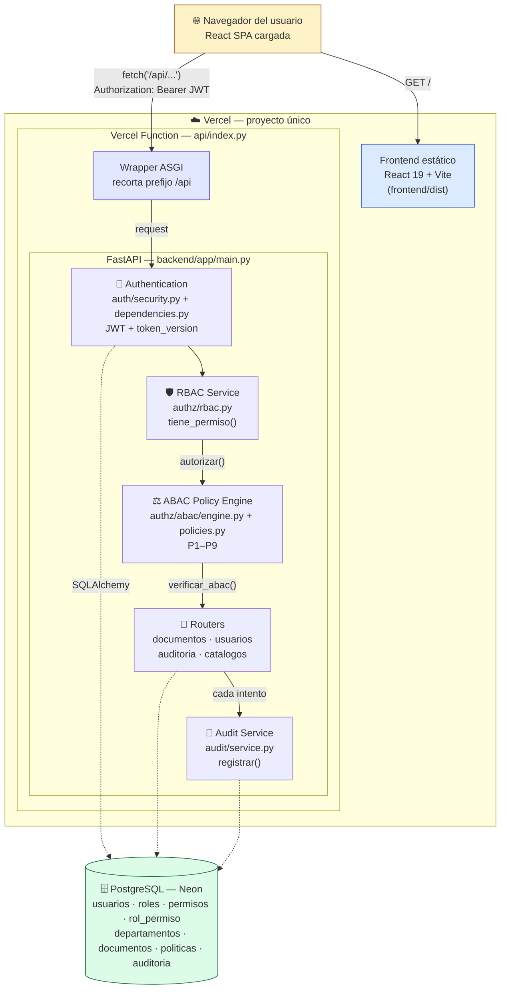

# Diagrama de arquitectura — SecureDocs

Un único proyecto de Vercel sirve el frontend estático y el backend (como Vercel Function ASGI). El wrapper de la función recorta el prefijo `/api` y delega en el mismo FastAPI que corre en local, que aplica el flujo de dos etapas RBAC → ABAC antes de tocar cualquier documento, y audita cada intento contra Neon. Detalle completo en `CONTEXT.md` secciones 8 y 14.

> Fuente editable: [`diagrama_arquitectura.mmd`](diagrama_arquitectura.mmd) (abrir en [Mermaid Live](https://mermaid.live) para editar). Versión estática: [`diagrama_arquitectura.png`](diagrama_arquitectura.png).
