# Evidencias de los casos de prueba

Los 17 casos de esta sección corresponden exactamente a los 12 escenarios obligatorios del enunciado del laboratorio (sección 15) más 5 casos adicionales diseñados por el equipo — el enunciado pide "cinco casos de prueba adicionales" y aquí están marcados como A1–A5.

**Entorno de la evidencia:** ejecutados el 2026-09-24 contra el **sistema desplegado en producción** (https://securedocs-ruby.vercel.app), con la base de datos recién reseñada (`python -m app.seed`). Las capturas de pantalla de la interfaz se tomaron contra el mismo código corriendo en local (commit idéntico al desplegado) por limitaciones de la herramienta de automatización de navegador disponible en esta sesión; las peticiones HTTP mostradas abajo sí son directas contra producción. Usuarios y documentos según `CONTEXT.md` sección 10 (contraseña de todos: `Demo1234!`).

Todas las capturas de pantalla están en [`docs/screenshots/`](screenshots/).

---

## Casos obligatorios del enunciado

### 1. Empleado consulta documento de su área → Permitido

**Actor:** Luis Paredes (EMPLEADO, FINANZAS) · **Recurso:** D1 "Informe de gastos Q3" (FINANZAS)

```
GET /api/documentos/1
→ 200 OK
{"id":1,"titulo":"Informe de gastos Q3","departamento":"FINANZAS","nivel_confidencialidad":2,"estado":"PENDIENTE","pais":"PE","propietario_id":4,...}
```

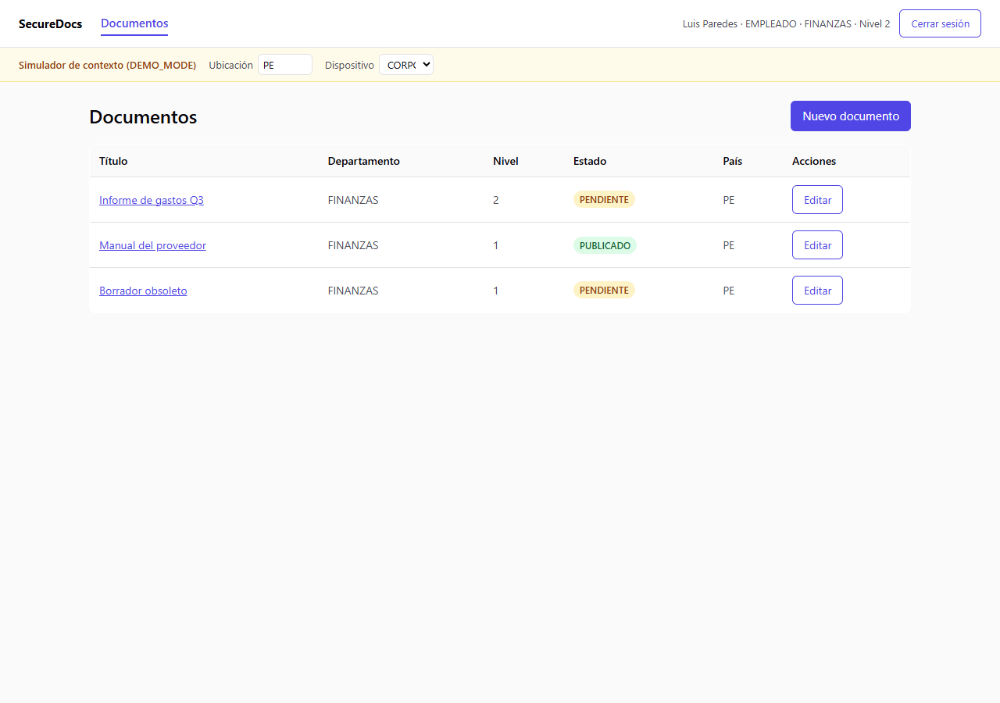

### 2. Empleado consulta documento de otra área → Denegado

**Actor:** Luis Paredes (FINANZAS) · **Recurso:** D2 "Plan de capacitación" (RRHH)

```
GET /api/documentos/2
→ 403 Forbidden
{"detail":"Departamento distinto (FINANZAS ≠ RRHH)"}
```

Política que falla: **P1 (Departamento)**.

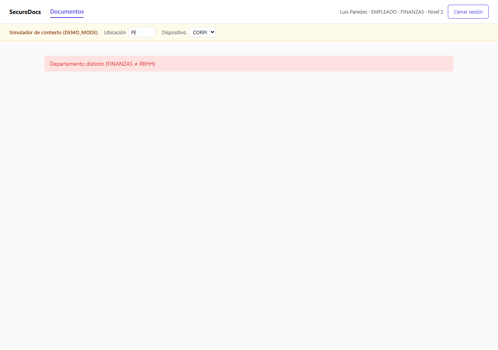

### 3. Supervisor aprueba documento de su área → Permitido

**Actor:** Carlos Ruiz (SUPERVISOR, FINANZAS) · **Recurso:** D3 "Presupuesto anual" (FINANZAS, PENDIENTE)

```
POST /api/documentos/3/aprobar
→ 200 OK
{"id":3,"titulo":"Presupuesto anual","estado":"PUBLICADO","aprobado_por":3,"fecha_aprobacion":"2026-09-24T04:55:01Z",...}
```

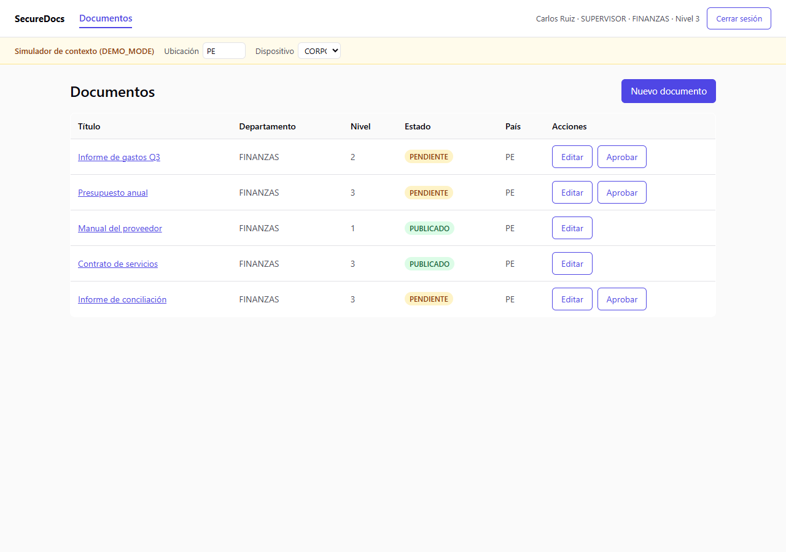
*Nótese que D3 ("Presupuesto anual") ya no tiene botón "Aprobar" — queda PUBLICADO.*

### 4. Empleado intenta aprobar documento → Denegado por RBAC

**Actor:** Luis Paredes (EMPLEADO) · **Recurso:** D1 (propio, pero eso no importa: RBAC corta antes)

```
POST /api/documentos/1/aprobar
→ 403 Forbidden
{"detail":"No tienes permiso para esta operación"}
```

Denegado en la **etapa RBAC** (EMPLEADO no tiene `DOC_APROBAR`) — ni siquiera se evalúa ABAC. El botón "Aprobar" no existe en la interfaz para este rol (ver captura del caso 1 arriba); este resultado se forzó invocando el endpoint directamente para demostrar que el backend es la autoridad real, no solo la UI.

### 5. Usuario nivel 2 consulta documento nivel 4 → Denegado por ABAC

**Actor:** Luis Paredes (nivel_seguridad 2) · **Recurso:** D4 "Proyección de inversiones" (nivel_confidencialidad 4)

```
GET /api/documentos/4
→ 403 Forbidden
{"detail":"Nivel de seguridad insuficiente (2 < 4); Fuera del horario autorizado (08:00-18:00, hora actual: 23:54)"}
```

Políticas que fallan: **P2 (Nivel de seguridad)** + **P4 (Horario)** acumuladas (la prueba corrió fuera de horario laboral).

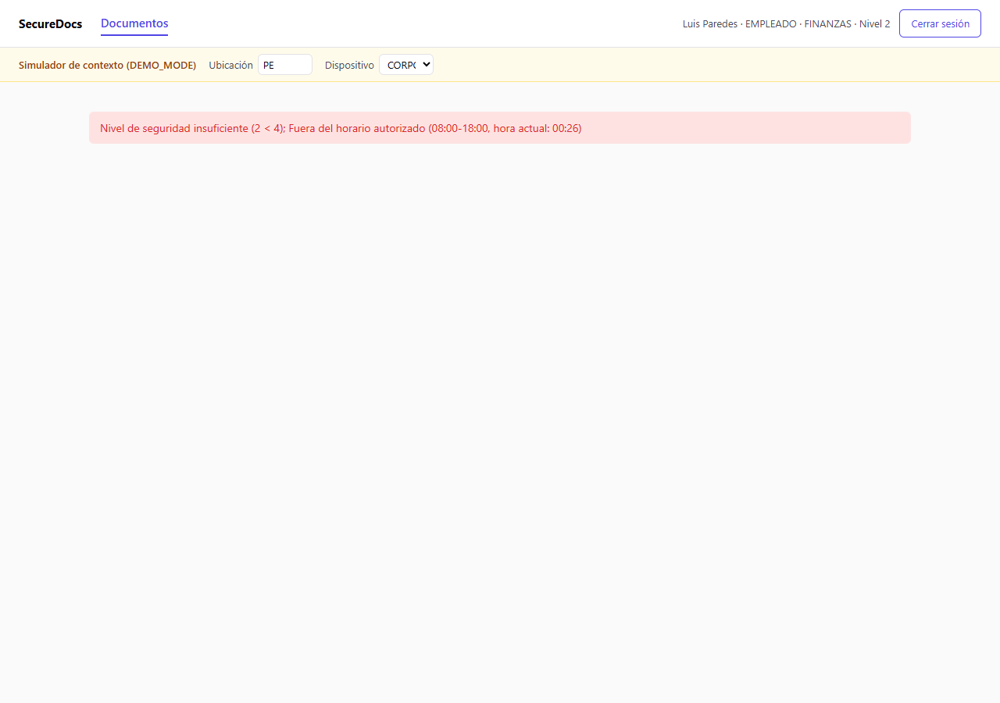

### 6. Gerente elimina documento → Permitido

**Actor:** Patricia Gómez (GERENTE, FINANZAS) · **Recurso:** D8 "Borrador obsoleto"

```
DELETE /api/documentos/8
→ 204 No Content
```

**Antes:**


**Después** (D8 "Borrador obsoleto" ya no aparece):

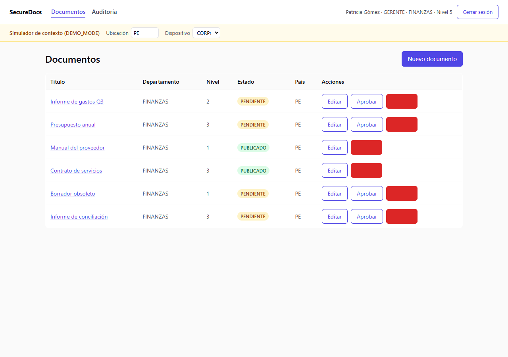

### 7. Auditor intenta modificar documento → Denegado por RBAC

**Actor:** Jorge Salas (AUDITOR) · **Recurso:** D1

```
PUT /api/documentos/1
→ 403 Forbidden
{"detail":"No tienes permiso para esta operación"}
```

AUDITOR solo tiene `DOC_CONSULTAR` — ninguna fila tiene botones de acción para este rol.

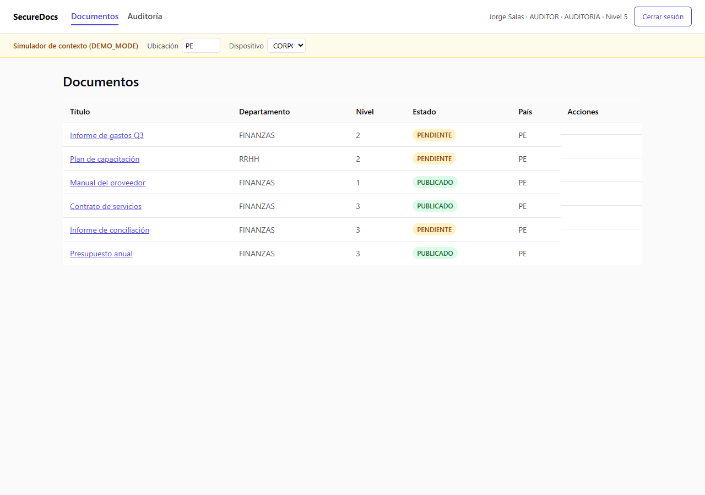

### 8. Usuario inactivo intenta acceder → Denegado

**Actor:** Pedro Vargas (estado INACTIVO)

```
POST /api/auth/login {"correo":"pedro.vargas@securedocs.pe","password":"Demo1234!"}
→ 403 Forbidden
{"detail":"Usuario en estado INACTIVO, se requiere ACTIVO"}
```

Política: **P7 (Estado del usuario)**, evaluada en el login.

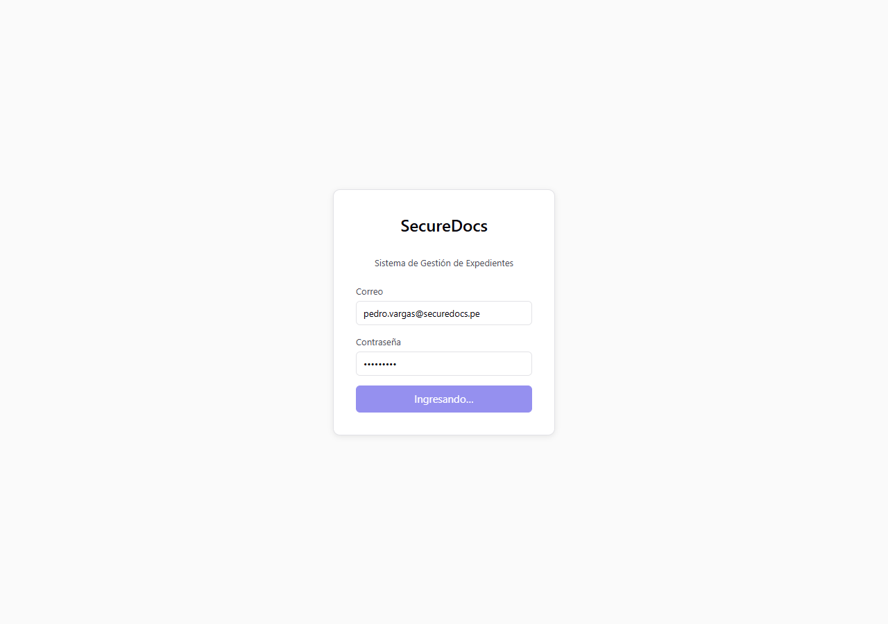

### 9. Documento confidencial accedido fuera de horario → Denegado por ABAC

**Actor:** Patricia Gómez (nivel 5, califica para P2) · **Recurso:** D4 (nivel 4)

```
GET /api/documentos/4
→ 403 Forbidden
{"detail":"Fuera del horario autorizado (08:00-18:00, hora actual: 23:54)"}
```

Solo falla **P4 (Horario)** — a diferencia del caso 5, aquí el nivel de seguridad sí califica, aislando el efecto de P4.


### 10. Documento nivel 5 accedido desde dispositivo personal → Denegado

**Actor:** Patricia Gómez, simulador con `X-Sim-Dispositivo: PERSONAL` · **Recurso:** D5 "Plan estratégico 2027" (nivel 5)

```
GET /api/documentos/5
Header: X-Sim-Dispositivo: PERSONAL
→ 403 Forbidden
{"detail":"Fuera del horario autorizado (08:00-18:00, hora actual: 23:54); Documento de nivel 5 requiere dispositivo CORPORATIVO (actual: PERSONAL)"}
```

Políticas: **P4** + **P6 (Dispositivo)** — obsérvese el simulador de contexto con el dispositivo cambiado a personal.

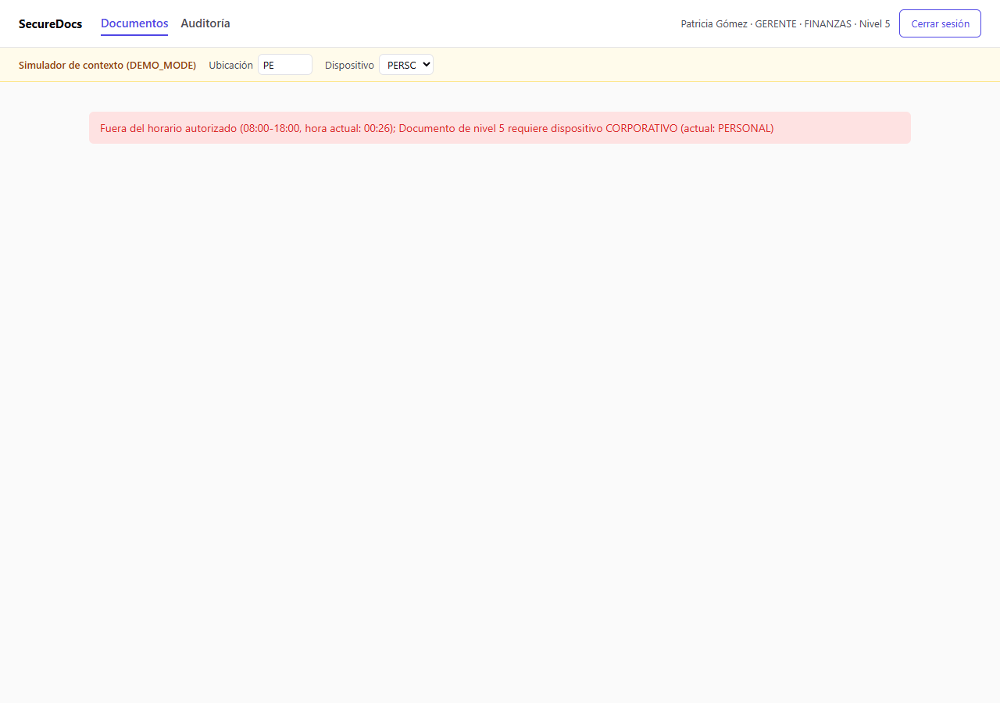

### 11. Invitado accede a documento público → Permitido

**Actor:** Proveedor Externo (INVITADO, contrato EXTERNO) · **Recurso:** D6 "Manual del proveedor" (nivel 1, PUBLICADO)

```
GET /api/documentos/6
→ 200 OK
{"id":6,"titulo":"Manual del proveedor","nivel_confidencialidad":1,"estado":"PUBLICADO",...}
```

Cumple **P8 (Invitados)**: contrato EXTERNO + nivel ≤ 1 + estado PUBLICADO — es el único documento visible para este usuario.

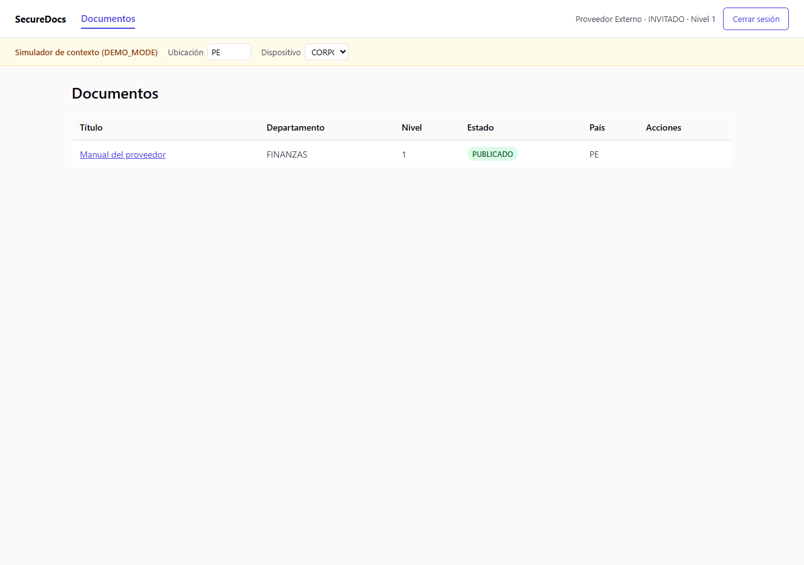

### 12. Invitado accede a documento confidencial → Denegado

**Actor:** Proveedor Externo · **Recurso:** D7 "Contrato de servicios" (nivel 3, PUBLICADO)

```
GET /api/documentos/7
→ 403 Forbidden
{"detail":"Nivel de seguridad insuficiente (1 < 3); Invitado no cumple las condiciones de acceso (contrato=EXTERNO, nivel=3, estado=PUBLICADO)"}
```

Políticas: **P2** + **P8** acumuladas (nivel 3 excede tanto su nivel de seguridad como el máximo permitido a invitados).

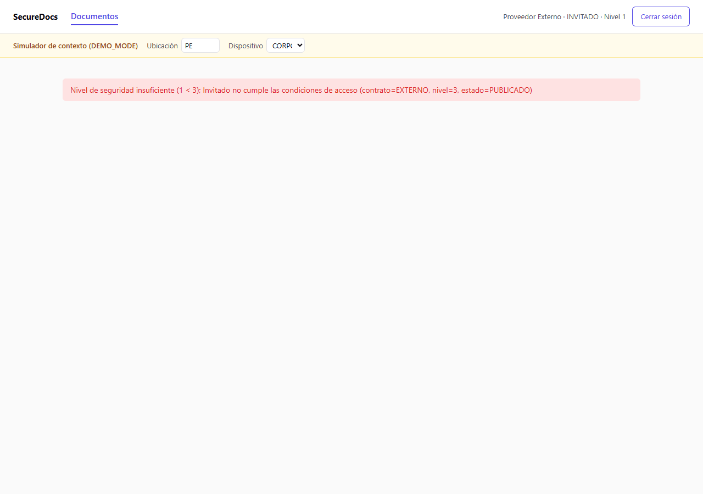

---

## Casos adicionales del equipo (5, según sección 15 del enunciado)

### A1. Empleado modifica documento ajeno (no es propietario) → Denegado por propiedad

**Actor:** Rosa Díaz (EMPLEADO, FINANZAS, tiene `DOC_MODIFICAR` por RBAC) · **Recurso:** D1 (propietario: Luis Paredes)

```
PUT /api/documentos/1 {"titulo":"hack"}
→ 403 Forbidden
{"detail":"El usuario no es propietario del documento"}
```

Política: **P3 (Propiedad)**. Demuestra que RBAC (permiso genérico de modificar) no es suficiente — ABAC exige ser el dueño del recurso concreto.

### A2. Documento consultado desde un país distinto al del documento → Denegado por país

**Actor:** Patricia Gómez (pais=PE), simulador con `X-Sim-Ubicacion: CL` · **Recurso:** D4 (pais=PE)

```
GET /api/documentos/4
Header: X-Sim-Ubicacion: CL
→ 403 Forbidden
{"detail":"Fuera del horario autorizado (08:00-18:00, hora actual: 23:54); País no coincide (usuario: PE, ubicación: CL, documento: PE)"}
```

Políticas: **P4** + **P5 (País)**.

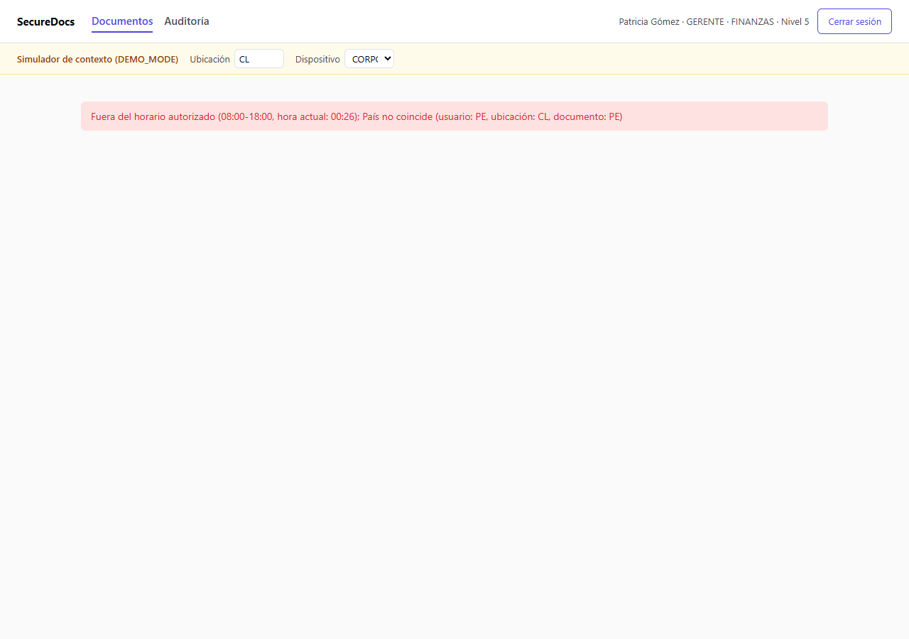

### A3. Propietario intenta aprobar su propio documento → Denegado por segregación de funciones

**Actor:** Carlos Ruiz (SUPERVISOR, tiene `DOC_APROBAR`) · **Recurso:** D9 "Informe de conciliación" (propietario: el mismo Carlos)

```
POST /api/documentos/9/aprobar
→ 403 Forbidden
{"detail":"El propietario de un documento no puede aprobarlo"}
```

Política: **P9 (Segregación de funciones)** — política agregada por el equipo más allá del mínimo del enunciado, para que nadie pueda autoaprobar su propio trabajo.

### A4. Token reutilizado después de logout → 401 (sesión revocada)

**Actor:** Luis Paredes

```
POST /api/auth/logout          → 204 No Content
GET  /api/documentos/1 (con el mismo token ya usado)
→ 401 Unauthorized
{"detail":"Sesión revocada, vuelve a iniciar sesión"}
```

El logout incrementa `token_version` en el servidor (decisión D8); cualquier token emitido antes queda inválido de inmediato, incluso si no ha expirado.

### A5. Usuario suspendido con sesión activa → Denegado en la siguiente petición

**Actor:** Luis Paredes, con un token válido ya emitido. Un Administrador lo suspende mientras esa sesión sigue activa.

```
PUT /api/usuarios/4 {"estado":"SUSPENDIDO"}   (ejecutado por admin@securedocs.pe)
→ 200 OK

GET /api/documentos/1 (con el token de Luis, emitido antes de la suspensión)
→ 403 Forbidden
{"detail":"Usuario en estado SUSPENDIDO, se requiere ACTIVO"}
```

Política: **P7 (Estado del usuario)**, re-evaluada en **cada petición** (no solo en el login, decisión D3) — por eso el bloqueo es inmediato aunque el JWT siga siendo técnicamente válido.

> **Nota sobre auditoría de este caso:** durante la preparación de este entregable se detectó que el rechazo de P7 en peticiones normales (a diferencia del login) no quedaba registrado en `auditoria`. Se corrigió `backend/app/auth/dependencies.py` para auditar también este caso — ver [`registro_auditoria.md`](registro_auditoria.md) y el bug documentado en `CONTEXT.md` sección 12.

---

## Resumen

| # | Caso | Resultado | Evidencia HTTP | Captura |
|---|---|:---:|:---:|:---:|
| 1 | Empleado consulta doc. de su área | ✅ Permitido | ✅ | ✅ |
| 2 | Empleado consulta doc. de otra área | ✅ Denegado (P1) | ✅ | ✅ |
| 3 | Supervisor aprueba doc. de su área | ✅ Permitido | ✅ | ✅ |
| 4 | Empleado intenta aprobar | ✅ Denegado (RBAC) | ✅ | ✅ |
| 5 | Nivel 2 consulta doc. nivel 4 | ✅ Denegado (P2+P4) | ✅ | ✅ |
| 6 | Gerente elimina documento | ✅ Permitido | ✅ | ✅ |
| 7 | Auditor intenta modificar | ✅ Denegado (RBAC) | ✅ | ✅ |
| 8 | Usuario inactivo intenta login | ✅ Denegado (P7) | ✅ | ✅ |
| 9 | Doc. confidencial fuera de horario | ✅ Denegado (P4) | ✅ | ✅ |
| 10 | Doc. nivel 5 desde dispositivo personal | ✅ Denegado (P4+P6) | ✅ | ✅ |
| 11 | Invitado accede a doc. público | ✅ Permitido | ✅ | ✅ |
| 12 | Invitado accede a doc. confidencial | ✅ Denegado (P2+P8) | ✅ | ✅ |
| A1 | Empleado modifica doc. ajeno | ✅ Denegado (P3) | ✅ | — |
| A2 | Consulta desde país distinto | ✅ Denegado (P4+P5) | ✅ | ✅ |
| A3 | Propietario aprueba su propio doc. | ✅ Denegado (P9) | ✅ | — |
| A4 | Token reutilizado tras logout | ✅ 401 | ✅ | — |
| A5 | Usuario suspendido con sesión activa | ✅ Denegado (P7) | ✅ | — |

**17/17 casos verificados exitosamente contra el sistema en producción.**
