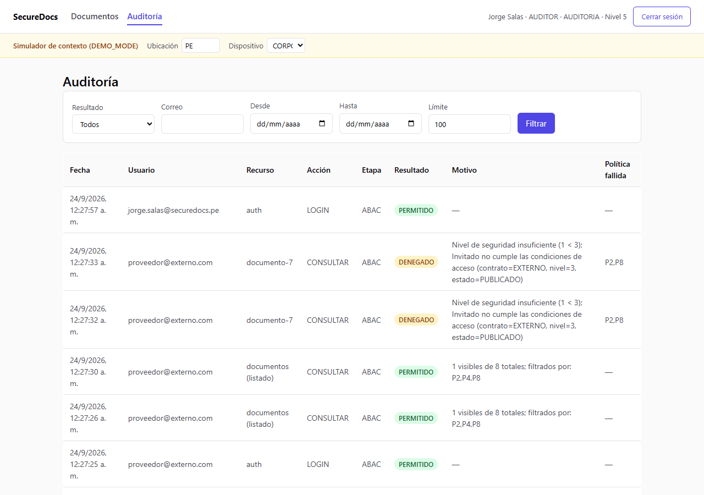

# Registro de auditoría

SecureDocs audita **todo intento de acceso** (permitido o denegado) en la tabla `auditoria`, solo-inserción: ningún endpoint la modifica ni la borra. Cada fila registra quién solicitó, qué recurso, qué acción, cuándo, el resultado, la etapa donde se decidió (AUTH/RBAC/ABAC) y — si fue denegado — el motivo exacto y qué política(s) fallaron.

Esto satisface el requisito de la sección 14 del enunciado: *"cada intento de acceso deberá generar un registro"* que permita conocer quién, qué recurso, qué operación, fecha/hora, resultado y motivo.

## Formato (comparado con el ejemplo del enunciado)

El enunciado pide un registro con esta forma:

```json
{
  "usuario": "carlos.ruiz",
  "recurso": "documento-501",
  "accion": "READ",
  "fecha": "2026-09-23T10:45:00",
  "resultado": "DENEGADO",
  "motivo": "Nivel de seguridad insuficiente"
}
```

El modelo real (`backend/app/models/auditoria.py`) cubre lo mismo y agrega: `usuario_id` (referencia real, no solo el nombre), `usuario_correo` (snapshot, sobrevive si el usuario se borra), `etapa` (para distinguir un rechazo de RBAC de uno de ABAC), y `politica_fallida` (el/los código(s) de política, ej. `"P2,P8"`, para trazabilidad exacta). Ver el modelo completo en [`modelo_base_datos.png`](modelo_base_datos.png).

## Bug encontrado y corregido durante la preparación de este entregable

Al capturar esta evidencia se detectó que el caso A5 (usuario suspendido con sesión activa, ver [`evidencias_casos_prueba.md`](evidencias_casos_prueba.md)) **no generaba fila en `auditoria`**: el rechazo de la política P7 en `get_current_user()` (evaluada en *cada* petición autenticada, no solo en el login) lanzaba el `403` sin llamar a `registrar()`, a diferencia del mismo chequeo P7 hecho en `/auth/login`, que sí auditaba. Se corrigió agregando el registro faltante en `backend/app/auth/dependencies.py` (ver `CONTEXT.md` sección 12, bug nuevo). Verificado localmente:

```
PUT /usuarios/4 {"estado":"SUSPENDIDO"}     (admin)
GET /documentos/1                            (Luis, sesión ya activa)
→ 403 "Usuario en estado SUSPENDIDO, se requiere ACTIVO"

GET /auditoria?usuario_correo=luis.paredes@securedocs.pe&resultado=DENEGADO
→ [{"recurso":"/documentos/1","accion":"CUALQUIERA","resultado":"DENEGADO","etapa":"ABAC","motivo":"Usuario en estado SUSPENDIDO, se requiere ACTIVO","politica_fallida":"P7"}]
```

## Registro real, generado ejecutando los 17 casos de prueba (2026-09-24)

Extraído vía `GET /auditoria?limit=60` contra el sistema en producción, con la base de datos recién sembrada — estas son las únicas 26 entradas en la tabla en ese momento, en orden cronológico. (Corresponde a la ejecución previa a la corrección del bug de arriba; por eso el caso A5 de esa corrida puntual no tiene fila propia — sí quedaron registrados los intentos de login, las consultas y modificaciones de documentos, y la gestión de usuarios.)

| ID | Fecha (UTC) | Usuario | Recurso | Acción | Etapa | Resultado | Motivo | Política(s) fallida(s) |
|---|---|---|---|---|---|---|---|---|
| 1 | 2026-09-24T04:54:22Z | pedro.vargas@securedocs.pe | auth | LOGIN | ABAC | DENEGADO | Usuario en estado INACTIVO, se requiere ACTIVO | — |
| 2 | 2026-09-24T04:54:23Z | admin@securedocs.pe | auth | LOGIN | ABAC | PERMITIDO | — | — |
| 3 | 2026-09-24T04:54:24Z | patricia.gomez@securedocs.pe | auth | LOGIN | ABAC | PERMITIDO | — | — |
| 4 | 2026-09-24T04:54:25Z | carlos.ruiz@securedocs.pe | auth | LOGIN | ABAC | PERMITIDO | — | — |
| 5 | 2026-09-24T04:54:26Z | luis.paredes@securedocs.pe | auth | LOGIN | ABAC | PERMITIDO | — | — |
| 6 | 2026-09-24T04:54:27Z | rosa.diaz@securedocs.pe | auth | LOGIN | ABAC | PERMITIDO | — | — |
| 7 | 2026-09-24T04:54:27Z | maria.quispe@securedocs.pe | auth | LOGIN | ABAC | PERMITIDO | — | — |
| 8 | 2026-09-24T04:54:28Z | jorge.salas@securedocs.pe | auth | LOGIN | ABAC | PERMITIDO | — | — |
| 9 | 2026-09-24T04:54:29Z | proveedor@externo.com | auth | LOGIN | ABAC | PERMITIDO | — | — |
| 10 | 2026-09-24T04:54:41Z | luis.paredes@securedocs.pe | documento-1 | CONSULTAR | ABAC | PERMITIDO | — | — |
| 11 | 2026-09-24T04:54:42Z | luis.paredes@securedocs.pe | documento-2 | CONSULTAR | ABAC | DENEGADO | Departamento distinto (FINANZAS ≠ RRHH) | P1 |
| 12 | 2026-09-24T04:54:42Z | luis.paredes@securedocs.pe | documento | APROBAR | RBAC | DENEGADO | El rol no tiene este permiso | — |
| 13 | 2026-09-24T04:54:43Z | luis.paredes@securedocs.pe | documento-4 | CONSULTAR | ABAC | DENEGADO | Nivel de seguridad insuficiente (2 < 4); Fuera del horario autorizado | P2,P4 |
| 14 | 2026-09-24T04:54:44Z | jorge.salas@securedocs.pe | documento | MODIFICAR | RBAC | DENEGADO | El rol no tiene este permiso | — |
| 15 | 2026-09-24T04:54:44Z | patricia.gomez@securedocs.pe | documento-4 | CONSULTAR | ABAC | DENEGADO | Fuera del horario autorizado | P4 |
| 16 | 2026-09-24T04:54:45Z | patricia.gomez@securedocs.pe | documento-5 | CONSULTAR | ABAC | DENEGADO | Fuera del horario autorizado; Documento de nivel 5 requiere dispositivo CORPORATIVO | P4,P6 |
| 17 | 2026-09-24T04:54:45Z | proveedor@externo.com | documento-6 | CONSULTAR | ABAC | PERMITIDO | — | — |
| 18 | 2026-09-24T04:54:46Z | proveedor@externo.com | documento-7 | CONSULTAR | ABAC | DENEGADO | Nivel de seguridad insuficiente (1 < 3); Invitado no cumple las condiciones de acceso | P2,P8 |
| 19 | 2026-09-24T04:54:47Z | rosa.diaz@securedocs.pe | documento-1 | MODIFICAR | ABAC | DENEGADO | El usuario no es propietario del documento | P3 |
| 20 | 2026-09-24T04:54:47Z | patricia.gomez@securedocs.pe | documento-4 | CONSULTAR | ABAC | DENEGADO | Fuera del horario autorizado; País no coincide (usuario: PE, ubicación: CL, documento: PE) | P4,P5 |
| 21 | 2026-09-24T04:54:48Z | carlos.ruiz@securedocs.pe | documento-9 | APROBAR | ABAC | DENEGADO | El propietario de un documento no puede aprobarlo | P9 |
| 22 | 2026-09-24T04:55:01Z | carlos.ruiz@securedocs.pe | documento-3 | APROBAR | ABAC | PERMITIDO | — | — |
| 23 | 2026-09-24T04:55:01Z | patricia.gomez@securedocs.pe | documento-8 | ELIMINAR | ABAC | PERMITIDO | — | — |
| 24 | 2026-09-24T04:55:03Z | luis.paredes@securedocs.pe | auth | LOGIN | ABAC | PERMITIDO | — | — |
| 25 | 2026-09-24T04:55:04Z | admin@securedocs.pe | usuario-4 | GESTIONAR_USUARIOS | RBAC | PERMITIDO | — | — |
| 26 | 2026-09-24T04:55:05Z | admin@securedocs.pe | usuario-4 | GESTIONAR_USUARIOS | RBAC | PERMITIDO | — | — |

**Lectura de algunas filas clave:**

- **Fila 1**: caso 8 (login denegado, P7).
- **Filas 10–21**: casos 1, 2, 4, 5, 7, 9, 10, 11, 12, A1, A2, A3, en ese orden — cada motivo y política coincide exactamente con lo documentado en [`evidencias_casos_prueba.md`](evidencias_casos_prueba.md).
- **Filas 22–23**: casos 3 y 6 (las dos mutaciones permitidas).
- **Filas 24–26**: caso A4/A5 en preparación (login de Luis antes de ser suspendido/reactivado por el admin).

## Cómo reproducir

```bash
python -m app.seed                      # deja la BD en estado semilla
# ejecutar los 17 casos de evidencias_casos_prueba.md
curl -H "Authorization: Bearer <token-admin>" \
     "https://securedocs-ruby.vercel.app/api/auditoria?limit=100"
```

O desde la interfaz: iniciar sesión con un usuario que tenga `AUDITORIA_VER` (Administrador, Gerente o Auditor) y abrir la pestaña **Auditoría**, con filtros por resultado, correo, rango de fechas:


